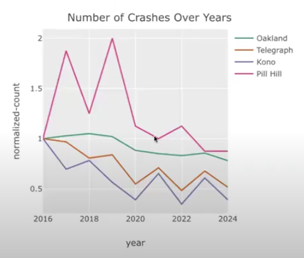

The [SciNoj Light #1](https://scicloj.github.io/scinoj-light-1) Conference brought together Clojure enthusiasts, data scientists, and researchers for an engaging exploration of data analysis stories.
The event fostered a collaborative, informal atmosphere where participants exchanged ideas across disciplines from cognitive psychology to urban planning.

If you missed it, you can view the talks on the [conference sessions playlist](https://www.youtube.com/playlist?list=PLb_VRZPxjMAAaoAPnk8ClWET3baRV1Whv).
The [conference website](https://scicloj.github.io/scinoj-light-1/speakers.html) has detailed information about the talks and speakers.
Links to the notebook code presented are on the [sessions page](https://scicloj.github.io/scinoj-light-1/sessions),
and available as data in the [info.edn file](https://github.com/scicloj/scinoj-light-1/blob/main/info.edn).

The [concluding talk on lane reductions](https://youtu.be/3HZ5rngHzWM) stood out as my favorite because it blended data-driven insights with relatable, human-interest storytelling.
As a cyclist, I immediately connected with how lane reductions and protected bike lanes are impactful to my safety.
The talk’s compelling visuals, grounded in real case studies, made the story very tangible.
Heather’s personal perspective as a car-free parent added emotional weight.
She illustrated how community advocacy and smart urban design saves lives, and makes more livable spaces.
The mix of passion, rigor, and optimism left me inspired; data analysis can drive tangible, life-improving change.

A major focus of the conference was the development of Clojure's data science [Noj](https://github.com/scicloj/noj) toolkit.
This suite of libraries demonstrated how Clojure combines functional programming elegance with practical performance.
Speakers highlighted Noj's interoperability with Python and Java ecosystems while emphasizing its advantages for reproducible and maintainable workflows.
The community's collaborative energy was evident throughout.

Artificial intelligence emerged as a recurring theme, with several talks exploring hybrid approaches to enhance reliability.
One discussion centered on Retrieval-Augmented Generation (RAG) systems,
where combining large language models with Clojure's logic programming capabilities could improve accuracy in structured domains like government Q&A.
Another session delved into probabilistic programming with Inferme, illustrating Bayesian methods for modeling uncertainty.
These technical deep dives were balanced by ethical considerations and reflections on technology's societal implications.

Scientific applications showcased Clojure's versatility.
One talk explored simulating fluid dynamics.
Another focused on forecasting tropical cyclone paths using physics-informed machine learning.
Cognitive science experiments were also featured, using collaborative games and puzzles to study human planning behavior, and brain wave monitors.
The conference also highlighted social impact work, such as data-driven advocacy for safer street designs, proving that technical tools can drive urban change.

What stood out to me was how effectively the SciCloj community uses Clojure notebooks for collaborative work.
Presenters shared their research through executable notebooks that cleanly combined code, visualizations and explanations.
It's a practical pattern broadly applicable for sharing ideas and knowledge.

Throughout the event, a sense of optimism prevailed about Clojure's untapped potential.
While acknowledging gaps in ML tooling compared to Python, speakers demonstrated that Clojure's functional rigor and JVM scalability make it a good fit for data science.
Attendee discussions envisioned collaborating further on logic-guided AI and semantic web ontologies.
There was a recurring theme of bridging the gap between academic theory and real-world engineering.
SciNoj Light ultimately painted a picture of Clojure not just as a language, but as a catalyst for interdisciplinary innovation.

> You can have the cake of Clojure's immutable persistent data structures and eat it too;  
> Get your answers fast and make your customers happy.  
> — Harold

A big thank you to the organizers!
The event was an overwhelming success with high quality presentations and valuable discussions.
I'm looking forward to the next SciNoj,
it's a rare and valuable blend of science, technology, community and code.

Below are my notes about the sessions and conversations from the conference.

### Pre-conference interview

Engaging to have a taste of what’s to come, got me really enthusiastic about the coming event.
Game as a Research Tool: "Tik Tik" is a controlled environment for studying human cognition and collaboration.
Combines cognitive psychology, game design, and data analysis.

### 1.1: Hello

Community-driven event.
Informal, interactive, and welcoming.
Focus on Clojure for data workflows.
Tools and libraries have matured, and the conference shares these advancements.
[Zulip](https://www.clojurians-zulip.org/) is the main forum, attendees are encouraged to engage via structured topic threads.
The macroexpand session invites ideas for expanding Clojure adoption in various fields.
Hosts encourage questions, jokes, and relaxed participation.
Sets the tone for an inclusive, engaging, and slightly nerdy gathering of Clojure enthusiasts.

### 1.2: An intro to the Noj toolkit

Noj is a Clojure-based data science toolkit integrating libraries for data analysis, visualization, and machine learning.
Designed for functional, efficient data processing with compatibility across libraries (e.g., Tablecloth, FastMath, Metamorph).
Inspired by tools like R’s dplyr/ggplot and Python’s pandas/Plotly, but with a Clojure-centric approach.
Tablecloth for tabular data manipulation (similar to pandas/dplyr).
TablePlot grammar-of-graphics-inspired visualization (like ggplot).
FastMath stats and statistical modeling (logistic regression and more).
Metamorph for machine learning workflows.
Worked example of predicting success in Kickstarter projects.
Data loading/cleaning, exploratory analysis (grouping, aggregation, bar plots),
predictive modeling, evaluation (train/test split, accuracy checks).
Functional & Immutable, Noj leverages Clojure’s strengths.
Efficient columnar storage with zero-copy operations.

### 1.3: Probability and statistics - Daniel Slutsky

Generating pseudo-random numbers using seeds for reproducibility in research.
Simulating dice rolls to explore distributions.
Used histograms and scatter plots to visualize distributions.
Computed mean, standard deviation and z-scores for comparison.
Bayesian inference for probabilistic models with parameters.
Conditioned models on observed data to infer posterior distributions.
Highlighted constraints and efficient sampling algorithms.
Avoid lazy sequences for large simulations; consider dtype-next or transducers.
Visualization matters, histograms and scatter plots reveal patterns.
Probabilistic programming models uncertainty and updates beliefs with data.
Balanced foundational stats with advanced topics, emphasizing Clojure’s tools for data science.

### 1.4: Customer churn analysis, LLMs & logic programming - Siavash Mohammady

Customers leaving significantly impacts revenue.
Exploring factors like course format, teacher experience, and registration patterns.
High churn in early months, newer teachers correlated with higher churn.
User prompt → NLP entity recognition → LLM generates high-level DSL → Clara rule engine translates to low-level DSL → Execution.
Mentorship for new teachers can reduce churn.
Pairing LLMs abstract reasoning with logic engines concrete execution optimizes complex data tasks.
A forward-looking talk blending data science, AI, and Clojure, emphasizing doing less.

### 1.5: Linear Foundations & Nonlinear Frontiers - Jelena Losic

Linear systems rely on superposition, the whole is the sum of parts.
Vector spaces, linear regression, Fourier analysis.
Real-world systems are often nonlinear.
Linear methods fail when data lies on curved manifolds or exhibits complex interactions.
Techniques like t-SNE, UMAP, and autoencoders handle nonlinearity by preserving structures or learning manifold geometry.
Nonlinear systems can be deterministic yet unpredictable.
Nonlinear methods unlock richer patterns but sacrifice interpretability and require more data.
Dimensionality reduction illustrates the trade-off between simplicity and accuracy.
Embeddings leverage linear algebra but rely on nonlinear transformations for deeper semantics.

### 1.6: RAGgedy Ann's Big Adventure - Paula Gearon

Vectors represent concepts in multidimensional space.
Embeddings convert text into vectors, capturing meaning.
Similarity between vectors is measurable.
Neural networks process inputs through weighted connections and activation functions.
Transformers contextualize words in sentences.
Combining LLMs with vector databases to reduce hallucinations.
Augmenting queries with retrieved context.
LLMs are built from modular math operations.
Vector databases enable semantic search.
RAG improves accuracy by grounding LLM outputs in verified data.

### 1.7: Parliamentary Questions - RAG Evaluation - Eoin Carney

Can RAG effectively answer parliamentary style questions using Irish government data?
10k publicly available Irish parliamentary questions and answers.
Compared sentence-based chunking with full document retrieval.
Tested multiple LLMs for generation and evaluation.
Retrieval Matters More Than Prompting.
Smaller, precise chunks of 3–5 sentences improved precision over full document retrieval.
Direct answer retrieval outperformed matching questions to answers. 
Deterministic metrics like word overlap failed to capture nuance.
LLM as judge worked better for correctness.
Clay notebook visualization helped explore vector embeddings interactively.
Government answers should be plain and factual.
LLMs are oddly well-suited for that.

### 1.8 - Discussion: RAGs and Structured Knowledge

Shared experiences using Clojure for AI projects.
Exploring logic programming as a superset of reasoning techniques and unifying them with embeddings and vector logic.
Foundational ontologies and their role in structuring knowledge for AI, particularly in medical domains.
The conversation fluidly shifted from technical to philosophical and practical.

### 1.9: Noj Deep Dive - Harold & Daniel Slutsky

Using Clojure for functional data science, contrasting it with Python tools like Pandas.
The focus is on immutability, performance, and leveraging Clojure’s strengths for data processing.
Tech.ml.dataset for tabular data processing.
Columnar storage for efficiency and integrates with other libraries in the ecosystem.
Layered Architecture.
Hamfisted high-performance, immutable collections optimized for JVM memory/CPU.
Dtype-next array random access and lazy, non-caching transformations.
Tablecloth high-level tabular data tools built atop these foundations.
Challenges and solutions for integrating with Python via libpython-clj and stdlang.
Hamfisted and Dtype-next enable Clojure to match Java/Python performance while retaining functional idioms.
20x speedup in lazy sequences.
Columnar storage in TMD reduces memory overhead.
Libraries like FastMath, MetamorphML, and Tableplot extend the stack.
Real-world applications in consulting and open-source collaboration.
Frequent shoutouts to contributors and emphasis on community input via Zulip.
If you think data science needs software engineering, you’re right.
A blend of technical rigor, community spirit, and practical focus on building scalable, functional data tools.

### 1.10: Brain data in Clojure - Lorelai Lyons

Ethical and Historical Context of Brain-Computer Interfaces.
Morally questionable history of neuroscience.
Need for ethical considerations in modern BCIs.
The goal is to bridge the gap between continuous human thought and discrete computing.
Neurons generate electrical signals that can be recorded and digitized.
EEG measures brainwave frequencies via electrodes placed on the scalp.
EEG data from a motor imagery study.
Applied filters to isolate frequency bands.
Developing a low-cost binary file system for efficient EEG data storage.
Exploring brain-controlled interfaces for creative applications.
Consumer EEG devices make brain data collection feasible for programmers.
BCIs require collaboration across neuroscience, hardware, and software.
Mixed technical depth with ethical reflection.

### 2.1: 1D Viscous Fluid Flow Data Analysis, Burgers’ Equation - Siyoung Byun

Fluid dynamics is complex, involving variables like friction, pressure, and momentum.
CFD uses computational methods to simulate fluid behavior, crucial for fields like aerospace, healthcare, and astrophysics.
Astrophysics simulations of binary star collisions use CFD.
Burgers’ Equation combines nonlinear convection (steepening fluid motion) and viscosity (smoothing/diffusion).
Demonstrated via simulations of a shock in a 1D fluid, visualized over time.
Used mutable Java arrays for performance.
Extending to 2D/3D simulations and incorporate the Navier-Stokes equations for full fluid dynamics.
Visualization Matters.
Plotting data is critical for interpreting simulations.
Siyoung emphasizes the learning process and invites collaboration.
Technical but accessible, viscosity effects are explained with analogies.
Passion for both astrophysics, fluid dynamics and Clojure shines through.
Simulations of white dwarf collisions brought home the realization that star interactions are fluid.
Korean ondol floor heating as an analogy for convection.

### 2.2: UK Electricity Demand Time Series Forecasting - Anton Lobach

The Taylor dataset contains electricity demand in Wales/England.
Extract day of week, minute of day, weekend flag.
Ridge regression regularized linear regression to prevent overfitting.
Use rolling origin cross-validation.
Root Mean Squared Error to measure forecast accuracy.
Clojure has expressive, modular workflows with strong data processing capabilities.
Seasonality matters.
Minute-of-day was the most predictive feature.
Ridge regression achieved reasonable accuracy.
Split data into train/test sets before exploratory analysis to avoid bias.
Use rolling windows for temporal data.
The tutorial is available as an interactive notebook.

### 2.3: Tropical cyclone trajectory modelling - K Ram Narayan, Naimish Mani B

Accurate trajectory forecasting is crucial for disaster preparedness, evacuation planning, and minimizing loss of life and property.
Forecasting relies on a mix of satellite data, computer simulations, and aircraft reconnaissance.
Using SINDy (Sparse Identification of Nonlinear Dynamics), to extract governing equations from cyclone trajectory data to predict future paths.
Global cyclone track dataset.
Satellite imagery used to compute wind velocity and shear via optical flow.
Incorporates cyclone dynamics to refine SINDy’s candidate equations.
Cyclone movement is driven by steering winds, Coriolis force, beta drift, and interactions with pressure systems.
Collect trajectory and satellite data.
Construct a candidate library of possible dynamical terms.
Use Lasso regression to sparsely select the most relevant terms.
Derive interpretable differential equations for forecasting.
SINDy achieved a 43.71 km mean absolute error, acceptable in cyclone forecasting.
Outperformed by gradient boosting, and random forest in single-step prediction but excels in full trajectory forecasting.
Bay of Bengal cyclones curve unpredictably due to land effects.
Bridges meteorology, physics, and machine learning for cyclone prediction.

### 2.4: Studying planning with a novel video game - Cvetomir Dimov

Planning is a fundamental cognitive ability used in everyday tasks.
"Tik Tik" game is designed to study planning.
Players control a fireball and an ice cube that must collaborate to navigate obstacles and reach targets.
A custom program was developed to generate and solve game levels, identifying optimal paths and measuring problem difficulty.
Goal is to understand what incentivizes planning.
Difficulty influenced by the number of barriers and their intersections.
Problem difficulty predictors were the minimum moves needed and the number of possible paths up to the optimal length.
Study 1 high dropout rates, large individual differences in planning ability.
Study 2 time limits and stricter move limits reduced dropouts and reinforced planning incentives.
Tight constraints encourage planning.
Problem difficulty can be systematically manipulated for cognitive research.
Demonstrations of the game and solver make abstract concepts tangible.
Credits multiple software tools, emphasizing a community-driven approach to research.

### 2.5: Building a Data Science Ecosystem in Clojure - Kira Howe

Inspiration from the Tidyverse (R).
A cohesive ecosystem with shared design principles on data and composable tools.
Standardized data structures and streamline workflows.
Fragmented tools create glue code overhead.
Immutable data and pure functions enable reproducibility.
JVM handles large-scale data efficiently.
Engineering culture emphasis on stability and interoperability.
Explosive data growth demands scalable, deterministic tools.
Noj as a Clojure based ecosystem inspired by Tidyverse but optimized for scalability and engineering.
Simplify onboarding through Jupyter support and Clojure in a box.
Need for Shiny-like tools for rapid prototyping.
Emphasized grassroots community building and learning together.
Data quality should be a philosophy, not an afterthought.

### 2.6: Macroexpand-1

Ways to broaden Clojure's impact beyond its traditional domains by fostering interdisciplinary collaboration.
Need to make Clojure more accessible and visible in fields like data science, education, and specialized industries.
Improve tooling, documentation, and community outreach.
Developer intuitive libraries, enhancing interoperability with other languages.
Lowering barriers for newcomers.
Importance of geospatial analysis and modern programming practices.
Sustainable community efforts and cross-disciplinary knowledge sharing.

### 2.7: The Impact of Lane Reductions - Heather Moore-Farley

Reducing car lanes, protected bike lanes, and pedestrian crossings decrease traffic injuries and fatalities.
California’s crash data used to visualize collision hotspots to push for safer street redesigns.
High injury corridors 6% of streets cause 60% of severe/fatal crashes.
Correlated lane reductions, protected bike lanes, and raised bus stops led to fewer crashes over time.
Local groups use data to advocate for safer streets.
Police reported crash data has missing ages, locations and underreporting driver fault.
Heather shares her lived experience as a car-free parent in Oakland, tying data to safety.
Design solutions and community action work.
Advocating for upcoming redesigns.
A compelling mix of data science, urbanism, and grassroots advocacy.
Number crunching can drive tangible change.
